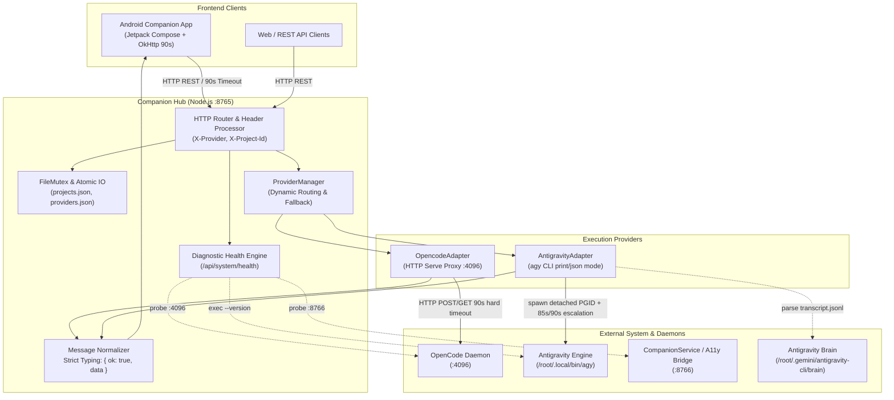

# Arquitectura del Backend: OpenCode & Antigravity Companion Hub

**Versión:** 2.0.0  
**Host Runtime:** Node.js v24 (Linux aarch64, POCO F3 "Alioth" / KernelSU)  
**Puertos Principales:** Hub API (`8765`), OpenCode Daemon (`4096`), Android Accessibility Bridge (`8766`)  
**Estado:** Producción, Concurrencia Atómica & Tipado Estricto  

---

## 1. Resumen Ejecutivo y Topología del Sistema

El **Companion Hub** actúa como el núcleo de orquestación local y proxy inteligente entre los clientes frontend (Aplicación Android Jetpack Compose `com.aegis.hub` y clientes web) y los motores de IA para desarrollo de software: **OpenCode** (daemon HTTP en puerto 4096) y **Google Antigravity CLI** (`/root/.local/bin/agy`).

### 1.1 Diagrama de Arquitectura de Alto Nivel



---

## 2. Abstracción y Adaptadores de Proveedores (`providers.js`)

La arquitectura implementa el patrón **Adapter** a través de `BaseProviderAdapter`, desacoplando completamente el protocolo de transporte de cada motor de IA.

### 2.1 `OpencodeAdapter` (Modo HTTP Serve)
- **Protocolo:** Comunicación directa vía `http.request` hacia `127.0.0.1:4096`.
- **Adaptación de Payloads:** OpenCode requiere estrictamente un array de `parts: [{ type: "text", text: "..." }]`. Si el cliente envía `text` plano o archivos adjuntos (`files` con base64), el adaptador los transforma transparentemente en bloques `parts` tipados.
- **Inyección de Contexto del Sistema:** Si se provee `projectId`, el adaptador inyecta dinámicamente un bloque de cabecera con:
  - Instrucciones personalizadas del proyecto (`project.instructions`).
  - Habilidades activas vinculadas (`skills`).
  - Resúmenes ejecutivos de proyectos vinculados (`cross-project context`).
- **Control de Ciclo de Vida y Timeouts:**
  - **Timeout duro de 90 segundos:** Configurado tanto en el socket como en el temporizador del adapter. Si el motor OpenCode o el proveedor LLM aguas arriba no responde en 90s, el socket se destruye forzosamente y devuelve un error HTTP 504.
  - **Detección de Desconexión Temprana:** Integra `AbortSignal` vinculado al evento `close` de la petición del cliente (`req.on("close")`), destruyendo los sockets huérfanos si el usuario cancela o cierra la aplicación.

### 2.2 `AntigravityAdapter` (Modo CLI Print/JSON)
- **Protocolo:** Invocación no interactiva del binario `/root/.local/bin/agy`.
- **Flags Canónicos:**
  ```bash
  /root/.local/bin/agy \
    --conversation <convId> \
    --model <modelId> \
    -p "<prompt>" \
    --output-format json \
    --dangerously-skip-permissions \
    --print-timeout 85s
  ```
- **Gestión de Procesos en Árbol y Aislamiento:**
  - `spawn` con `{ detached: true }`: Sitúa el subproceso en su propio grupo de procesos (`PGID`).
  - **Escalada de Cancelación:** A los 90 segundos o ante desconexión del cliente, envía `SIGTERM` al grupo (`process.kill(-pid, "SIGTERM")`). Si el proceso no finaliza en 2 segundos, escala a `SIGKILL` (`process.kill(-pid, "SIGKILL")`).
- **Limpieza de Procesos Zombi (`cleanupZombieProcesses`):**
  - Escanea `/proc` periódicamente y en cada ciclo de salud.
  - Detecta procesos huérfanos (`ppid === 1`) o en estado zombi (`state === 'Z'`) ejecutando `agy` en modo print (`-p`).
  - **Salvaguarda Crítica:** NUNCA toca procesos interactivos con terminal asignada (`tty_nr !== 0`, e.g., sesiones de terminal `pts/0`), ni procesos del propio Node.js.
- **Mapeo de Conversaciones:** Asocia bidireccionalmente el `sessionId` del frontend con el UUID `conversation_id` generado en `/root/.gemini/antigravity-cli/brain/<uuid>`.

---

## 3. Modelo de Concurrencia Atómica y Almacenamiento

Para prevenir condiciones de carrera (*race conditions*), actualizaciones perdidas (*lost updates*) y corrupción de JSON por reinicios inesperados, se implementó una capa de persistencia atómica:

### 3.1 Mutex Asíncrono en Memoria (`FileMutex`)
Todas las operaciones de lectura-modificación-escritura sobre `projects.json` y `providers.json` se serializan mediante promesas encadenadas por ruta de archivo (`fileMutex.runExclusive(filePath, async () => { ... })`).

### 3.2 Escritura Atómica en Disco (`atomicWriteFileSync`)
1. Los datos se escriben primero en un archivo temporal único en el mismo directorio: `.<filename>.<timestamp>.<random>.tmp`.
2. Se ejecuta `fs.fsyncSync(fd)` para forzar el vaciado del buffer de Linux a almacenamiento no volátil.
3. Se invoca `fs.renameSync(tmpFile, targetFile)`. En sistemas de archivos compatibles con POSIX (incluyendo el almacenamiento montado en Android), `rename` es una llamada al sistema **atómica**: nunca expone un archivo parcial o corrompido a lectores concurrentes.

---

## 4. Normalización Estricta de Contratos de API (REST Envelope)

Todos los endpoints clave cumplen estrictamente con la especificación `Envelope<T>` de `docs/FRONTEND_CONTRACT.md` y los modelos Android de Kotlin (`Models.kt`).

### 4.1 Formato Canónico del Envelope
```json
{
  "ok": true,
  "data": { ... }
}
```
En caso de error:
```json
{
  "ok": false,
  "error": "Descripción detallada del error",
  "code": "CODIGO_OPCIONAL"
}
```

### 4.2 Compatibilidad Dual en Mensajes (`Message`)
Para soportar tanto clientes que consumen `Envelope<Message>` como clientes Retrofit que mapean directamente el cuerpo a `Message`, la respuesta de `POST /opencode/session/:id/message` expone los campos aplanados en la raíz y encapsulados en `data`:
```json
{
  "ok": true,
  "data": {
    "role": "assistant",
    "text": "Contenido de la respuesta...",
    "info": {
      "id": "msg_agy_123_1789933882287",
      "role": "assistant",
      "timestamp": 1789933882287,
      "time": { "created": 1789933882287 },
      "status": "SENT",
      "deliveryStatus": "SENT"
    },
    "parts": [
      {
        "id": "prt_1789933882287",
        "type": "text",
        "text": "Contenido de la respuesta..."
      }
    ]
  },
  "role": "assistant",
  "text": "Contenido de la respuesta...",
  "info": {
    "id": "msg_agy_123_1789933882287",
    "role": "assistant",
    "timestamp": 1789933882287,
    "time": { "created": 1789933882287 },
    "status": "SENT",
    "deliveryStatus": "SENT"
  },
  "parts": [
    {
      "id": "prt_1789933882287",
      "type": "text",
      "text": "Contenido de la respuesta..."
    }
  ]
}
```

### 4.3 Cabeceras Globales con Persistencia Inmediata
- **`X-Provider`:** Permite forzar dinámicamente `"opencode"` o `"antigravity"`. El backend actualiza y persiste de inmediato el proveedor asignado a la sesión en `projects.json`.
- **`X-Project-Id`:** Vincula la sesión al proyecto indicado. Si la sesión no estaba vinculada previamente, se registra atómicamente con fecha de última actividad (`lastUsed`).

---

## 5. Endpoints Principales Robustecidos

| Endpoint | Método | Descripción | Headers Clave | Payload Retornado |
|---|---|---|---|---|
| `/api/system/health` | `GET` | Diagnóstico integral del sistema (Node, A11y, agy, permisos) | N/A | `{ ok: true, data: SystemHealth }` |
| `/api/projects/:id` | `PATCH` | Actualización de nombre, descripción, instrucciones y proveedor | `X-Provider`, `X-Project-Id` | `{ ok: true, data: Project }` |
| `/api/projects/:id/sessions` | `GET` | Listado cronológico inverso de sesiones vinculadas al proyecto | N/A | `{ ok: true, data: List<SessionRef> }` |
| `/api/projects/:id/sessions` | `POST` | Vinculación/registro inmediato de sesión a un proyecto | `X-Provider` | `{ ok: true, data: SessionRef }` |
| `/opencode/session/:id/message` | `POST` | Envío de mensaje con timeout de 90s, inyección de contexto y ruteo dinámico | `X-Provider`, `X-Project-Id` | `{ ok: true, data: Message, ...Message }` |
| `/api/opencode/sessions/:id/messages` | `GET` | Historial unificado y cronológico de mensajes de la sesión | `X-Provider`, `X-Project-Id` | `{ ok: true, data: List<Message> }` |

---

## 6. Endpoint de Diagnóstico (`/api/system/health`)

El endpoint `/api/system/health` ofrece visibilidad completa sobre los subsistemas requeridos en entornos Android/Termux/Ubuntu:
- **`runtime`:** Versión de Node.js, ruta de ejecutable, PID del hub, tiempo activo (uptime), estadísticas de memoria (heap/rss) y plataforma.
- **`a11ySocket`:** Sonda HTTP activa a `http://127.0.0.1:8766/status` verificando el estado del `CompanionService` y la reparación reactiva de accesibilidad.
- **`agy`:** Validación de presencia de `/root/.local/bin/agy`, permisos de ejecución y verificación de respuesta vía `agy --version`.
- **`permissions`:** Comprobación en tiempo real de escritura en `/tmp` y `/sdcard/projects/opencode-companion`, verificación de UID root (`uid === 0`) y namespace actual.
- **`opencode`:** Sonda HTTP hacia `http://127.0.0.1:4096/global/health` reportando disponibilidad y versión.

---

## 7. Supervisor y Resiliencia (`keepalive.sh`)

- **Gestión de Bloqueo:** Utiliza `/sdcard/projects/opencode-companion/keepalive.lock` para prevenir instancias duplicadas.
- **Protección de Sesiones TUI:** Distingue rigurosamente entre procesos de OpenCode TUI interactivos en terminales virtuales (`tty_nr !== 0`, pts) y el modo daemon (`tty_nr === 0`), garantizando que los reinicios del hub nunca cierren la sesión manual del desarrollador.
- **Recuperación Automática:** Cada 10 segundos evalúa la disponibilidad de OpenCode (`:4096`) y del Hub (`:8765`), relanzando de forma limpia los procesos caídos.
